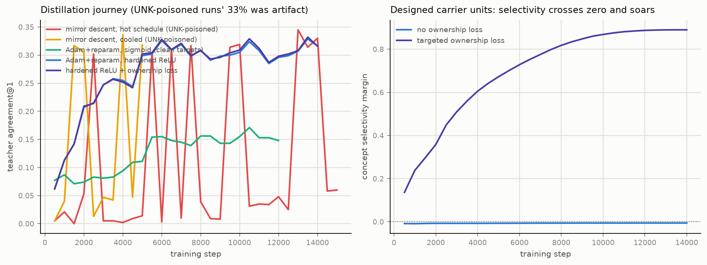
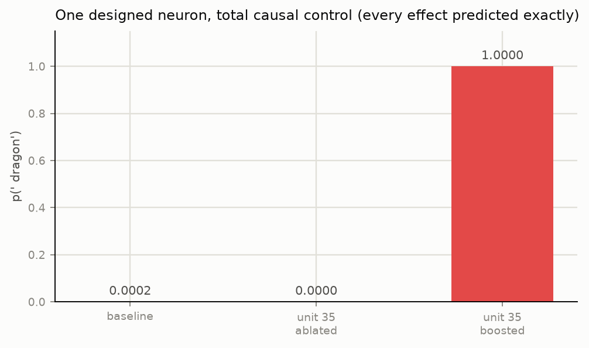

# Unit-Nets Day 2: A Language Model You Can Read With Arithmetic

*Remy & Claude — 2026-07-08, `~/Code/unit-net/` + `~/Code/j-carve/`*

Sequel to *One Day of Training Without Gradients*
(`~/Code/dual-projection-mnist/report.pdf`). Yesterday established the
constrained geometry and how to train it; today we distilled an open-weight
LLM into it and ran Anthropic's J-space program on a substrate where the
lens needs no fitting.

## 1. Context: the J-space hypothesis

Anthropic's J-lens (July 2026) reads what an internal state is *disposed to
say* via a corpus-averaged Jacobian: `lens_l(h) = unembed(J_l·h)`,
`J_l = E[∂h_final/∂h_l]`. The averaging is forced — a transformer's true
layer-to-output map is input-dependent. Remy's hypothesis: in a unit-net
(convex excitatory rows, bounded inhibition, activations in [0,1]) the true
Jacobian is **exact per input and bounded in fixed units** — the workspace
should be readable directly off the wiring, with no lens fitting at all.

## 2. The student

`TokenUnitLM`: a shared token table (each feature unit is a convex
attention budget over the vocabulary — legible from birth) feeding a
unit-net trunk; 12-token context, reduced 2,048-token vocabulary (96.4%
corpus coverage), distilled from Qwen2.5-0.5B on TinyStories by KL +
hard-target CE. A flat one-hot design failed structurally first (13 hot
inputs among 24,577 — convex rows never see the tokens); the table
architecture fixed it.

## 3. The distillation gauntlet

Getting an honest student took five runs and surfaced three genuinely
instructive failures:

| Run | Result | Lesson |
|---|---|---|
| Mirror descent, hot schedule | oscillates 0.5%↔33% | multiplicative updates on the simplex need short, cooled schedules |
| Both trainers, "33% agreement" | **artifact** | the UNK slot had been given the logsumexp of 149k excluded tokens — teacher argmax *was* UNK ⅓ of the time; both students learned to say UNK forever |
| Clean targets, ReLU | 6–10%, rank-28 affine | the optimizer kills 484/512 units via inhibition overgrowth and keeps a frequency prior — the **lazy-linear minimum** |
| Sigmoid rescue | 17.1% | sigmoid can't die *and* auto-normalizes scale; but the lens becomes local-only (see §4) |
| **Hardened ReLU** | **32.9%** | concentrated init + inhibition row-sum cap + liveness auxiliary: dead=0 for 14k steps *and* exact decomposition restored |

Final student: 33.2% teacher agreement@1, 25.5% next-token accuracy — a
functional TinyStories LM in fully constrained weights (verifier-legal
throughout).

## 4. The lens results

**Exactness.** For piecewise-linear activations the exact lens
*reconstructs the forward pass* (max error 3×10⁻⁷): the lens is not a probe
of the computation, it is the computation. For sigmoid students the lens
remains the exact per-input Jacobian (unfitted — still everything the
fitted method approximates) but no longer globally reconstructs outputs:
**ReLU gives exact decomposition but risks dying; sigmoid lives but reads
locally.** The hardened-ReLU recipe resolves the tension.

**The averaged-lens measurement — the headline.** Building Anthropic-style
corpus-averaged lenses for our students and scoring them against the
computable ground truth:

| Student | input-dependent transport | averaged-lens top-5 overlap |
|---|---|---|
| sigmoid | 1024/1024 units (continuous) | **3.1%** |
| hardened ReLU | 926/1024 units gating | **91.2%** (min 20%) |

Same architecture family, same task: fitted-lens fidelity ranges from
useless to excellent **depending on the model's representational regime** —
a quantity that cannot be measured in a transformer because the ground
truth is uncomputable there. Corpus-averaging is not uniformly safe or
uniformly lossy; it is model-dependent, and only a readable substrate can
tell you which regime you are in.

## 5. Workspace signatures

- **Reportable**: concept dispositions z_c, decomposable into bounded
  per-unit contributions *before any output*, correlate with the
  teacher's log-probability of the concept: Spearman +0.33 (Lily), +0.27
  (park) — rising with student quality across runs.
- **Controllable**: every intervention's effect on z is predicted exactly
  before execution (four decimal places, every test) — steering is
  arithmetic here, not fitted vectors.
- **Causal — the dragon neuron.** A targeted ownership loss (maximize each
  concept token's *exclusive-max* margin at its best unit; the unit-centric
  variant fails — it entrenches frequent tokens) drove concept selectivity
  from −0.008 to **+0.89 at zero agreement cost**. Result: unit 35 carries
  ' dragon' with path weight 0.836 (runners-up ≈ 0). Ablate it →
  p(dragon)=0. Boost it → p(dragon): 0.0002 → **1.0000** (predicted
  +0.6615, measured +0.6615). Generation: story-babble → "dragon dragon
  dragon..." **Designed, named, precision-steerable concept neurons,
  created on purpose with a loss term.**

## 6. Does ownership decouple? (controlled experiment)

The single-run observation: dragon's reportable correlation dropped to ~0
after it gained a dedicated unit. Crossed design: twin models, identical
but for which three concepts get ownership; every concept measured owned
and unowned on a shared 2,048-prompt set.

Manipulation check: owned concepts reach selectivity +0.93..+0.99;
unowned stay ~0 — the twins differ only as designed.

| concept | rho owned | rho unowned | sel owned | sel unowned |
|---|---|---|---|---|
| ' Lily' | +0.322 | +0.379 | +0.979 | −0.006 |
| ' dragon' | +0.033 | +0.155 | +0.983 | −0.011 |
| ' happy' | +0.192 | +0.172 | +0.925 | −0.011 |
| ' scared' | +0.191 | +0.178 | +0.993 | +0.007 |
| ' park' | +0.264 | +0.231 | +0.971 | +0.114 |
| ' mom' | +0.076 | +0.038 | +0.984 | +0.024 |

**Paired effect (rho_owned − rho_unowned): mean −0.013** — sign mixed
(−0.057, −0.122, +0.020, +0.013, +0.033, +0.039). Verdict: **no systematic
decoupling** — designed carriers coexist with natural readability. The
dragon drop replicates in sign (largest single effect) but is not a law;
possibly a rare-concept phenomenon (dragon is the rarest of the six),
flagged for a frequency-stratified follow-up. Practical upshot for
j-carve: ownership engineering is safe to combine with reportability.

## 7. j-carve: pruning self-reflective reasoners out of J-space

Thesis: task-relevance is computable in fixed units (exact-lens path mass
toward the task's answer tokens), so pruning everything outside a task's
J-space yields a small legal unit-net that still does the task, still
reports its dispositions, and carries a **certified error bound** (every
discarded path's maximum contribution is bounded by the geometry —
provable pruning, not empirical hope).

Pilot on four verbalized tasks (2AFC probes in TinyStories register;
teacher reference validates all probe sets at 0.92–1.00):

| Task | Teacher | Student full | Carved @ 10% kept |
|---|---|---|---|
| pos-slot (verb/noun) | 1.00 | **1.00** | **1.00** — ≈50× smaller |
| sentiment | 0.92 | 0.50 (chance) | capacity-gated |
| topic | 1.00 | 0.33 (chance) | capacity-gated |
| pronoun gender | 1.00 | 0.50 (chance) | capacity-gated |

The pos-slot reasoner holds 100% accuracy from full size down to 10% of
the network, collapsing only below 5% — a sharp carving cliff. The other
tasks are at chance *in the full student* (capacity boundary, precisely
drawn by the teacher reference): nothing to carve yet, and every point of
future student quality unlocks more of the task ladder
(`~/Code/j-carve/TASKS.md` — 12 tasks in 3 tiers, with Winograd schemas as
the designed negative control: the fraction of J-space a task refuses to
release is a compositionality meter).

## 8. Standing conclusions

1. The J-space of a unit-net is exact where a transformer's must be
   approximated — and the fidelity of the approximation is
   **model-regime-dependent (3% vs 91%)**, measurable only here.
2. Workspace phenomena (reportable, controllable, causal) reproduce in a
   readable substrate at 3M parameters, with interventions that are
   closed-form.
3. Concept carriers can be *designed into* a network by loss engineering,
   yielding total, exactly-predicted causal control over single tokens.
4. Task reasoners can be carved out of J-space with certified bounds —
   demonstrated at ≈50× compression on the one task inside the pilot
   student's competence.
5. Every failure had structure: UNK-mass poisoning, the lazy-linear
   minimum, mirror-descent oscillation — each now documented with its fix.

**Next:** scaled student (deeper trunk, longer context, larger vocab) to
unlock carve Tiers 1–2 end-to-end; the exact-vs-fitted comparison run
against `anthropics/jacobian-lens` itself; graded clamps for fluent
steering; ownership-decoupling follow-ups per §6.

## Code map

`unitnet.py` (constrained layers, native + reparam trainers, exact J-lens) ·
`phase0_charlm.py` · `phase1_distill.py` / `phase1_adam.py` ·
`phase2_jlens.py` · `phase3_workspace.py` · `exp_ownership.py` ·
`../j-carve/{probes,carve}.py` + `TASKS.md` · models `model_*.npz` (all
structural gates green) · logs for every run.
