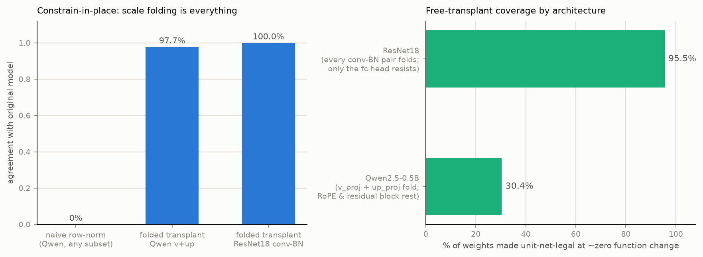
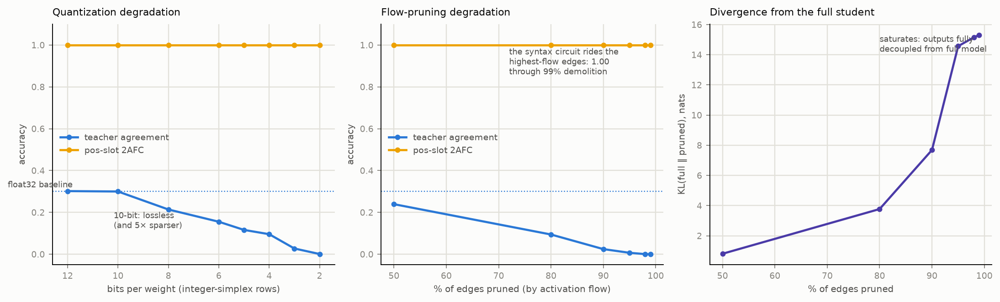
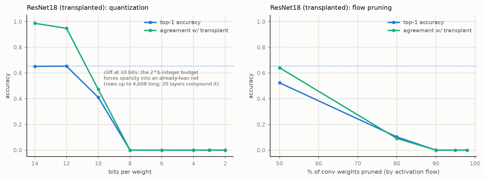

# Unit-Nets Day 3: Transplants, Integer Rows, and the Highways of Syntax

*Remy & Claude — 2026-07-10, `~/Code/unit-net/`*

Third in the series (Day 1: *One Day of Training Without Gradients*; Day 2:
*A Language Model You Can Read With Arithmetic*). Remy opened with three
ideas; all three ran to results, and one of them rewrote the project's
migration strategy.

## 1. Idea 1 — weight transplant instead of distillation

The proposal: don't train a constrained student at all — take a pretrained
network's weights and *make them legal in place*: normalize each row's
positive weights to sum to 1, bound its negatives by the row's most
negative magnitude.

**Naive version: total collapse.** Constraining even one Qwen block this
way gives 0.4% agreement with the original; all 24 blocks, 0.0%. Row
normalization destroys each row's output scale (positive sums run 10–100),
and transformers cannot absorb per-row scales downstream. Day 1's
"post-hoc projection collapses" lesson, replicated at 500M parameters.

**Folded version: nearly free.** Use a *single* per-row divisor (the
positive sum) and fold it, exactly, into the next matrix — legal wherever
the connecting path is linear in the scaled quantity:

- `v_proj → o_proj`: attention mixes values linearly (softmax weights
  depend only on q,k). Requires GQA-aware scale replication (2 KV heads
  serve 14 query heads) and scaling v's *bias* along with its rows — the
  one-hour bug.
- `up_proj → down_proj`: `down(SiLU(gate) ⊙ up)` is linear in `up`.

Result on Qwen2.5-0.5B: **97.7% agreement, zero clipped negatives,
107M weights (~30% of the linears) fully unit-net-legal.** Blocked
families, each for a nameable reason: q/k (RoPE rotates dimension pairs;
per-dim scales don't commute), gate (SiLU isn't homogeneous), o/down
(write to the residual stream — nowhere left to push the scale debt).

**Then the ResNet.** CNNs are built out of exactly the two mechanisms
that make folding total: BatchNorm exists to absorb scale
(`running_mean /= s`, `running_var /= s²`, plus an exact ε-correction
folded into γ), and ReLU is positively homogeneous. Every conv-BN pair in
ResNet18 folds:

| | agreement | clipped negatives | weights made legal |
|---|---|---|---|
| Qwen naive | 0.000 | — | — |
| Qwen folded (v+up) | 0.977 | 0 / 107M | 30.4% |
| **ResNet18 folded (all conv-BN)** | **0.9995** | **0 / 11.2M** | **95.5%** |

Top-1 on Imagenette identical to the fourth decimal (65.32% vs 65.30%).
Only the fc head (no BN behind it) resists. **A pretrained ResNet is a
unit-net that doesn't know it yet** — and remarkably, not one filter in
the entire network has a negative weight exceeding its positive budget.
Transplant (97.7–99.95%) beats distillation (33%) so thoroughly that the
project's migration path is now: *transplant what folds, constrained-
finetune the remainder.*

## 2. Idea 2 — native integer quantization

The proposal: use the full numerical range; explore ints; find the
bits-per-weight degradation curve. The geometry makes this native: a
convex P-row stored as **integer numerators summing to exactly 2^b**
(largest remainder) is exact fixed-point arithmetic with a shared
denominator — no float error, ever. N entries take the uniform 2^b grid
on [0,1].

| bits | LM student agree | LM pos-slot | ResNet top-1 |
|---|---|---|---|
| float32 | 0.300 | 1.00 | 0.653 |
| 12 | 0.302 | 1.00 | 0.653 |
| 10 | **0.300 (lossless)** | 1.00 | 0.410 |
| 8 | 0.214 | 1.00 | 0.000 |
| 4 | 0.096 | 1.00 | 0.000 |
| 2 | 0.001 | 1.00 | 0.000 |

Two findings. First, for the LM student **10 bits is lossless *and* 5×
sparsifying** (3.4M → 710k nonzero entries): a 2^b integer budget spread
over a longer row forces zeros, so in this geometry the bit budget *is* a
sparsity budget. Second, that same coupling is a liability for lean deep
nets: ResNet's 4,608-weight filters amputated to ≤256 nonzeros at 8 bits,
and 20 layers compound the noise — cliff at 10 bits, dead at 8. **Law:
simplex quantization needs its denominator ≥ the row length; tolerance to
constraint-native compression measures the redundancy training left
behind.**

## 3. Idea 3 — activation-flow pruning

The proposal: importance = summed activation flow per edge over a corpus;
raise the floor, watch behavior diverge. Task-agnostic counterpart of
j-carve's task-specific path mass.

| edges pruned | LM agree | LM KL vs full | LM pos-slot | ResNet top-1 |
|---|---|---|---|---|
| 50% | 0.239 | 0.81 | 1.00 | 0.524 |
| 80% | 0.094 | 3.77 | 1.00 | 0.103 |
| 90% | 0.024 | 7.69 | 1.00 | 0.000 |
| 99% | 0.000 | 15.3 | 1.00 | — |

## 4. The cross-cutting finding: syntax rides the highways

Across *every* destructive condition on the LM — 2-bit quantization, 99%
edge pruning, models whose general agreement is statistically zero — the
pos-slot syntax task held **1.00**. The verb/noun circuit lives on the
highest-flow edges, which every mass-respecting destruction method spares
last; the semantic capillaries die first. Combined with j-carve (Day 2):
task-targeted carving keeps the circuit at 4% of the network *on
purpose*; indiscriminate flow-pruning keeps it at 1% *by accident*; and
nothing kills it short of aiming at its specific edges. **Syntax rides
the trunk roads; meaning lives in the side streets.**

## 5. Artifacts

- **Channel-level 3D explorer** — the whole transplanted ResNet18 as 3,917
  channel-nodes / 9,620 net-weight edges with residual arcs; conv1 nodes
  open their actual RGB 7×7 filters (every filter now a unit budget, so
  intensities are comparable across the layer):
  <https://claude.ai/code/artifact/c51a40dc-016a-44ae-89ed-141fbd26e98a>
- **Voxel-level whole-net explorer** — every implicit conv neuron
  explicit: 19 stages, 1,098 voxels colored by real activations on a
  church image, 13,784 *exact* receptive-field edges drawn as
  low-clearance curves; orbit + pan + zoom; weight sharing directly
  visible (same channel, shifted window, identical cone):
  <https://claude.ai/code/artifact/ff2ee392-5a45-4fcd-9487-f22841c0decf>
  (v1 with the lofted arcs cached for posterity as
  `resnet_voxels_v1.py`/`.html`.)
- Interlude deliverable (Day 2.5): the pos-slot carving task ported to a
  self-contained builder kit at `~/Downloads/posslot-carve-task/`
  (task draft in the house style, oracle solution, pre-encoded probes).

## 6. Standing conclusions

1. **Constraint migration is mostly free where normalization can absorb
   scale**: ~100% of CNN convs, ~30% of transformer linears, exactly and
   with zero clipping in practice. Distillation is the wrong tool for
   moving pretrained networks into the geometry; folding is the right one.
2. **The geometry quantizes and sparsifies as one operation** — integer
   simplex rows — with a sharp, predictable validity condition
   (denominator ≥ row length).
3. **Robustness to native compression is a redundancy meter**: the fat
   shallow student shrugged off what killed the lean deep CNN.
4. **Functional anatomy is stratified by flow**: syntax on highways,
   semantics on capillaries — measured, not metaphor.

**Next:** constrained-finetune the transplanted models to retire the
remaining scale debt (q/k/gate/o/down; ResNet's fc); rerun the J-lens and
workspace program on the transplanted ResNet (95.5% legal = the exact
lens now applies to a *real ImageNet model*); j-carve Tier-1 tasks
against a transplant-initialized student.

## Code map (Day 3 additions)

`transplant.py` (Qwen naive + folded) · `resnet_transplant.py` (conv-BN
fold, Imagenette eval) · `quantize_lm.py` / `resnet_degrade.py` (integer-
simplex sweeps) · `flow_prune.py` · `resnet_viz3d.py` (channel explorer) ·
`resnet_voxels.py` (whole-net voxel explorer; v1 cached) ·
`viz_degradation.py` / `fig_*.png` · results JSONs ·
`resnet18_unitnet.pt`.
